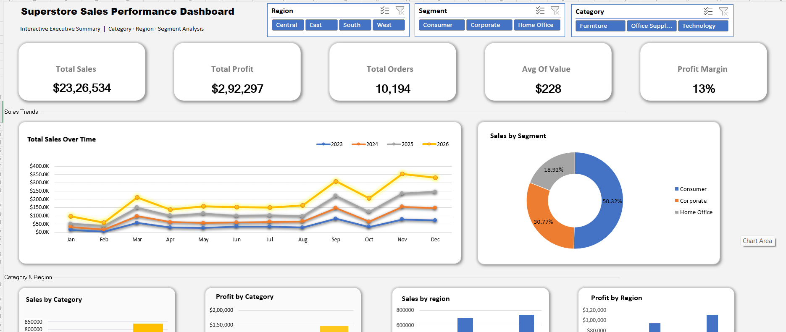
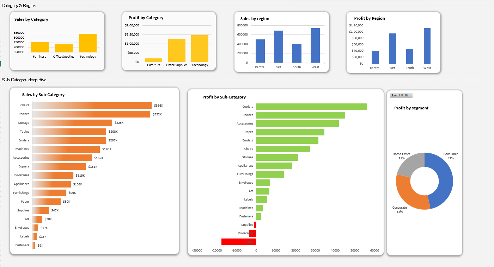

# Superstore Sales Performance Dashboard (Excel)

This project presents an interactive sales performance dashboard built using Excel to analyze retail business data across regions, categories, and customer segments.

## Dashboard Features

- KPI tracking: Sales, Profit, Orders, Avg Order Value, Profit Margin
- Region, Segment, and Category slicers
- Monthly sales trend analysis
- Category-wise performance comparison
- Region-wise profitability insights
- Sub-category level profit deep dive

## Tools Used

- Microsoft Excel
- Pivot Tables
- Pivot Charts
- Slicers
- Dashboard Design

## Key Insights

- Consumer segment contributes the highest share of sales
- Technology category leads revenue generation
- Some sub-categories show strong sales but low profitability
- Regional profit performance varies significantly

## Dashboard Preview

### Executive Summary View

### Category & Region Analysis

